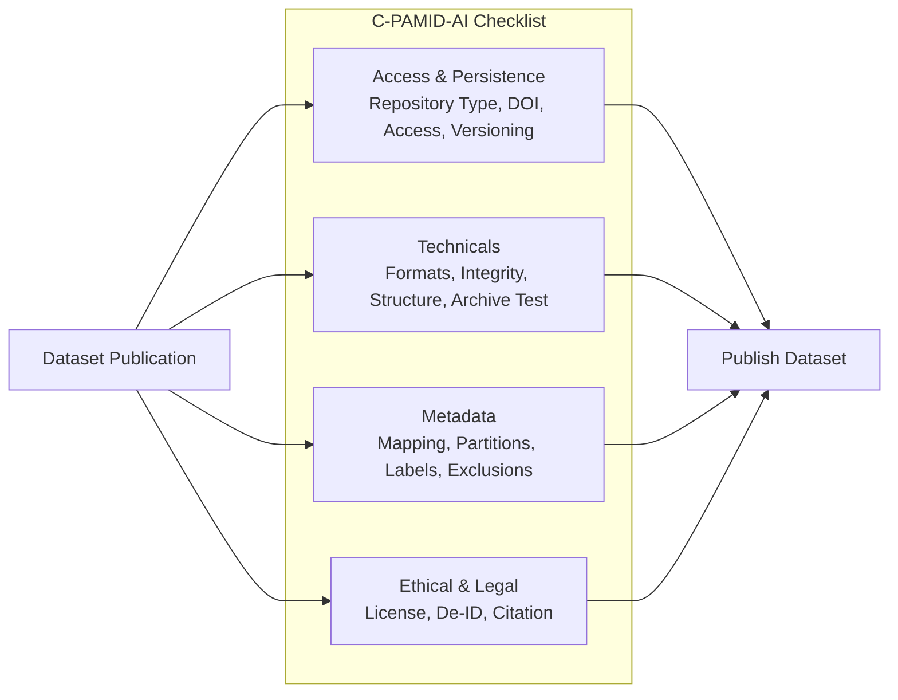
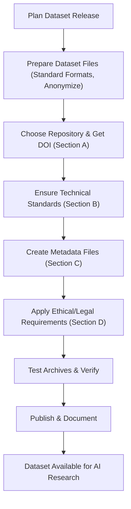

# C-PAMID-AI
## Checklist for Public Availability of Medical Imaging Datasets for AI

### Introduction

This repository hosts the C-PAMID-AI (Checklist for Public Availability of Medical Imaging Datasets for AI), a comprehensive framework designed to ensure that medical imaging datasets used in AI research are publicly available, reproducible, and ethically sound. With the growing importance of AI in healthcare, it's crucial that datasets are shared responsibly to facilitate transparency, validation, and advancement in medical imaging AI.

The checklist is divided into four core sections:

- **Section A: Dataset Access & Persistence** - Ensuring datasets remain accessible and discoverable over time.
- **Section B: Dataset Technicals** - Focusing on technical standards for data integrity and usability.
- **Section C: Metadata** - Providing essential information for reproducibility and data linkage.
- **Section D: Ethical and Legal** - Addressing privacy, licensing, and attribution requirements.

Each item includes a specific requirement and rationale to guide researchers, institutions, and reviewers in preparing and evaluating public datasets.

### Table of Contents

- [Section A: Dataset Access & Persistence](#section-a-dataset-access--persistence)
- [Section B: Dataset Technicals](#section-b-dataset-technicals)
- [Section C: Metadata](#section-c-metadata)
- [Section D: Ethical and Legal](#section-d-ethical-and-legal)
- [Diagrams and Visualizations](#diagrams-and-visualizations)

---

## Section A: Dataset Access & Persistence

Ensuring long-term accessibility and citation-ability of public datasets.

| ID  | Item                 | Requirement                                                                 | Rationale                                                                 |
|-----|----------------------|-----------------------------------------------------------------------------|---------------------------------------------------------------------------|
| A1  | Repository Type     | Dataset is hosted on a public recognized, indexable repository             | Prevents link decay when the author changes jobs or storage subscriptions expire. |
| A2  | Persistent Identifier| Dataset is assigned a specific DOI                                        | Ensures the dataset is citable and trackable separate from the paper.     |
| A3  | Access               | Access is either (1) Direct Download or (2) Automated Credentialing (Access is granted immediately upon submission of a form via the repository's automated system. | Fixes the "availability of dataset on reasonable request" or unresponsive authors. |
| A4  | Versioning          | The repository supports version control (v1.0, v1.1). The specific version used in the manuscript is identified. | If data is cleaned or removed later, the version used in the paper must remain identifiable. |

## Section B: Dataset Technicals

Technical standards to ensure data usability and integrity.

| ID  | Item                 | Requirement                                                                 | Rationale                                                                 |
|-----|----------------------|-----------------------------------------------------------------------------|---------------------------------------------------------------------------|
| B1  | Standardized Formats| Imaging data is provided in non-proprietary standards (DICOM, NIfTI, NRRD, PNG). If proprietary formats are used (specific vendor raw files), a functioning open-source conversion script is included. | Prevents vendor lock-in; ensures researchers without specific commercial software can open the files. |
| B2  | File Integrity      | A list of hash values (MD5, SHA-256) is provided for archive files or individual images. | Verifies that the file downloaded wasn't corrupted during transfer. |
| B3  | Directory Structure | The folder hierarchy is documented                                      | Prevents the dumping of files where relationships between files cannot be established. |
| B4  | Archive Test        | The author confirms that compressed archives have been test-extracted on a machine different from the one that created them. | Ensures no local path dependencies or compression errors exist. |

## Section C: Metadata

Essential metadata for reproducibility and data safety.

| ID  | Item                 | Requirement                                                                 | Rationale                                                                 |
|-----|----------------------|-----------------------------------------------------------------------------|---------------------------------------------------------------------------|
| C1  | Patient-to-Image Mapping | A metadata file (CSV/JSON) explicitly links Image Names to anonymized Patient IDs. | Essential to prevent Data Leakage. AI models must not have different images from the same patient in both Training and Test sets. |
| C2  | Partition Keys      | The exact unique identifiers (Patient IDs or filenames) used for Training, Validation, and Testing splits in the associated paper are provided as static lists. | Allows other/external/independent researchers to exactly reproduce the results of the paper using the same data splits. |
| C3  | Label Definitions   | A data dictionary defines all target labels and clinical variables.      | Resolves ambiguity for other/external/independent researchers to validate the results of the paper. |
| C4  | Exclusion Log       | If Public dataset contains n images but the paper only used m, a list of the n-m excluded IDs is provided with proper reasons. | Ensures the benchmark cohort is clearly defined. |

## Section D: Ethical and Legal

Privacy, licensing, and attribution considerations.

| ID  | Item                 | Requirement                                                                 | Rationale                                                                 |
|-----|----------------------|-----------------------------------------------------------------------------|---------------------------------------------------------------------------|
| D1  | Explicit License    | A standard license file is mentioned in the repository root.               | Public does not mean Open Source. Users must know if they can use the data for commercial models or how updates to published dataset by external contributors are handled. |
| D2  | De-identification   | A statement confirms that all files (including DICOM headers) have been stripped of any data that reveals patient information. | Protects patient privacy and protects the user from legal liability. |
| D3  | Citation Requirement| The preferred citation (paper DOI or dataset DOI) is clearly stated in a README or CITATION file. | Ensures the original data creators receive credit. |

---

## Diagrams and Visualizations

The following diagrams provide visual overviews of the checklist and its application.

### 1. Checklist Overview Diagram

This diagram illustrates the four main sections of the checklist, each connected to key requirements for a holistic approach to dataset availability.



### 2. Dataset Publication Workflow

A step-by-step workflow for applying the checklist during dataset preparation and publication.



### 3. Requirements Fulfillment Map

A mind map showing the interrelationships between checklist items and their contributions to overall goals.

```mermaid
mindmap
  root((C-PAMID-AI)):::root
    (Access & Persistence):::section
      ::icon(fa fa-lock)
      A1 Repository Type -> Long-term Availability
      A2 DOI -> Citability
      A3 Access Method -> Easy Retrieval
      A4 Versioning -> Reproducibility
    (Dataset Technicals):::section
      ::icon(fa fa-cogs)
      B1 Standardized Formats -> Vendor Independence
      B2 File Integrity -> Trusted Downloads
      B3 Directory Structure -> Organized Access
      B4 Archive Test -> Error Prevention
    (Metadata):::section
      ::icon(fa fa-tags)
      C1 Patient-Image Mapping -> Prevent Leakage
      C2 Partition Keys -> Exact Reproduction
      C3 Label Definitions -> Clear Understanding
      C4 Exclusion Log -> Transparent Benchmaking
    (Ethical & Legal):::section
      ::icon(fa fa-scale)
      D1 License -> Usage Clarity
      D2 De-identification -> Privacy Protection
      D3 Citation -> Attribution

  classDef root fill:#e6f3ff,stroke:#0056b3,stroke-width:3px,color:#0a4a8a
  classDef section fill:#f0f8ff,stroke:#2e7d32,stroke-width:2px,color:#1b5e20
```

### 4. Before-and-After Impact

Illustrates the transformative effect of applying this checklist on dataset utility.

```mermaid
flowchart LR
    subgraph "Before Checklist"
        Broken[Broken Links<br/>Unavailable Datasets]
        Proprietary[Proprietary Formats<br/>Vendor Lock-in]
        UnclearMetadata[Unclear Metadata<br/>Reproducibility Issues]
        PrivacyRisk[Privacy Risks<br/>Legal Issues]
        Broken --> Issues
        Proprietary --> Issues
        UnclearMetadata --> Issues
        PrivacyRisk --> Issues
    end
    subgraph "After Checklist"
        Persistent[Persistent Access<br/>Citable Datasets]
        Standard[Standard Formats<br/>Open Access]
        ClearDoc[Clear Documentation<br/>Reproducible Results]
        Ethical[Ethical Compliance<br/>Safeguarded Use]
        Persistent --> Benefit[Better AI Research Outcomes]
        Standard --> Benefit
        ClearDoc --> Benefit
        Ethical --> Benefit
    end
    Issues[Dataset Challenges] --> Results[Application Improves] --> Benefit
